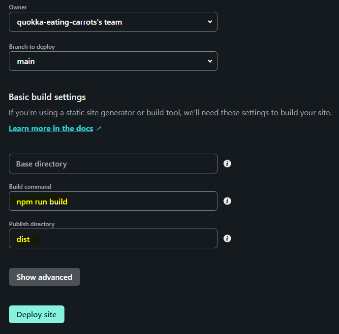

# `webpack`을 사용하여 `netlify` 배포까지!

[배포된 사이트 보러 가기](https://peppy-wisp-f65386.netlify.app/)
~~참고로 webpack 공부를 위한 사이트이므로 별내용이 없습니다!~~

# `webpack` 사용 시 터미널에서 설치한 것

```
$ npm i -D webpack
$ npm i -D webpack-cli webpack-dev-server@next
```
`webpack`은 `parcel`과 다르게 세세하게 설정해 줘야 될 부분이 많다. 첫 번째 줄은 `webpack` 자체를 개발자 설정으로 다운, 두 번째 줄은 `webpack-cli` 버전과 개발자 서버를 실행할 때 `webpack`의 버전을 맞춰 주기 위해서 `@next`를 붙여서 서버를 다운해 준다.

```
$ npm i -D html-webpack-plugin
$ npm i -D copy-webpack-plugin
```
  `webpack`이 html과 연결된 다른 파일들을 읽을 수 있게 하는 plugin이다.

## 기본 `webpack` 설치 후 `package.json`에 추가한 것
```json
"script": {
	"dev": "webpack-dev-server --mode development",
	"build": "webpack --mode production"
},
```
`parcel`을 사용했을 때는 `parcel index.html`과 `parcel build index.html`을 사용한 것과 비슷하다.

## 기본 `webpack` 설치 후 `webpack.config.js` 파일에 추가한 것
```javascript
const path = reauire('path')
const HtmlPlugin = require('html-webpack-plugin')
const CopyPlugin = require('copy-webpack-plugin')

// export
module.exports = {
  // 파일을 읽어들이기 시작하는 진입점 설정
  entry: './js/main.js',
  
  //결과물(번들)을 반환하는 설정
  output: {
    // path: path.resolve(__dirname, 'dist'),
    // filename: 'main.js',
    clean: true
  },

  plugins: [
    new HtmlPlugin({
      template: './index.html'
    }),
    new CopyPlugin({
      patterns: [
        { from: 'static' }
      ]
    })
}
```

주석으로 설명이 적혀 있지만 더 적어 보자면, `output` 부분에 주석으로 처리된 코드는 기본적인 설정이 저렇게 되어 있기 때문에 주석으로 처리해도 잘 동작한다. dirname, filename은 수정해도 괜찮지만 기본 설정으로 두는 것을 권장한다. <br>
`clean`은 저장을 했을 때, 기존의 파일을 지우고 새로운 파일을 덮어쓴다는 의미이다.<br>
`CopyPlugin`에서 static은 webpack이 배포 버전으로 변환을 할 때 기본적으로 생각하는 파일 경로를 설정해 주는 것이다.

## `css, scss` 사용하기 위해 설치한 것
```
$ npm i -D css-loader
$ npm i -D style-loader
$ npm i -D sass-loader sass
```
## `css, scss` 로드를 위해 `webpack.config.js` 파일에 추가한 것

```javascript
  module: {
    rules: [
      {
        test: /\.s?css$/,
        use: [
          'style-loader',
          'css-loader',
          // 'postcss-loader',
          'sass-loader'
        ]
      },
```
정규표현식을 사용하여 css와 scss 모두 파일을 읽을 수 있게 하였습니다.
(중간에 주석 처리된 부분은 후에 설명) <br>
이 부분을 `module.exports`와 `plugins` 사이에 적어 두었습니다.

## `main.js`로 `css` 파일 불러오기
`webpack.config.js`를 보면 파일을 읽어들이기 시작하는 부분이 `main.js`로 되어 있기 때문에 `html` 파일에 `css` 경로를 연결하게 되면 제대로 읽히지 않을 수가 있습니다. `main.js` 파일에 `css`를 불러오는 경로를 추가합니다.
```javascript
import css from '../css/main.css' // 혹은 본인이 사용하는 링크, scss
// import '../css/main.css' 도 가능
```
## 공급 업체 접두사
`parcel`을 사용할 때와 같이 공급 업체 접두사를 설정해 줍니다.
```
$ npm i -D postcss
$ npm i -D autoprefixer
$ npm i -D postcss-loader
```

사진에 표시된 것처럼 브러우저마다 다른 설정값을 (혹은 구 버전) 사용할 수 있게 해 주는 것입니다.

## 공급 업체 접두사 설치 후 `package.json` 파일에 추가한 것
```json
"browserslist": [
	"> 1%",
	"last 2 versions"
]
```
해석을 해 보자면, 상위 1%가 사용하는 가장 마지막 두 버전까지 적용하겠다.

## 공급 업체 접두사 설치 후 `.postcssrc.js` 파일 생성
```javascript
module.exports = {
	plugins: [
		require( 'autoprefixer' )
	]
}
```
그리고 위에 작성했던 `webpack.config.js` 파일에 아래와 같이 `postcss-loader`을 추가해 줍니다.
```javascript
  module: {
    rules: [
      {
        test: /\.s?css$/,
        use: [
          'style-loader',
          'css-loader',
          'postcss-loader',
          'sass-loader'
        ]
      },
```

## `babel` 설치하기
```
$ npm i -D @babel/core
$ npm i -D @babel/preset-env
$ npm i -D @babel/plungin-transform-runtime
$ npm i -D babel-loader
```
`babel`은 javascript 컴파일러입니다. javascript를 버전에 맞춰서 변환해 주는 것이라고 할 수 있습니다.

## `babel` 설치 후 `.babelrc.js` 파일 생성
```javascript
module.exports = {
  presets: ['@babel/preset-env'],
  plugins: [
    ['@babel/plugin-transform-runtime']
  ]
}
```

## `babel` 설치 후 `webpack.config.js` 파일에 추가한 것
```javascript
{
  test: /\.js$/,
  use: [
    'babel-loader'
  ]
}
```

`module` 안에 `rules`와 같은 배열로 해당 내용을 넣습니다. `.js` 파일을 모두 읽겠다는 의미입니다.


# `netlify` 배포 시 주의할 점!

사진에 표시된 것처럼 `build`되는 명령어와 directory를 꼭 확인해야 합니다.
